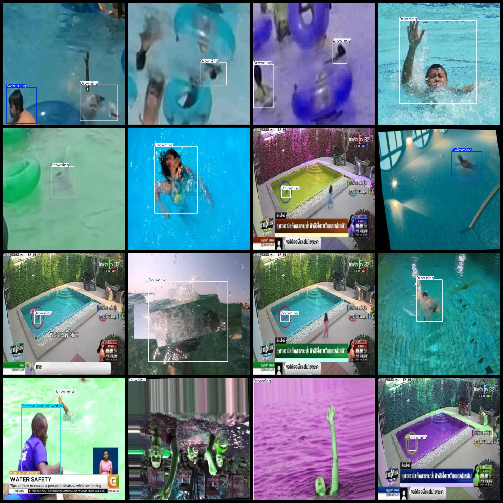

# Swimming Drowning Detection Dataset (VOC+YOLO)

## Dataset Format: Pascal VOC format + YOLO format (txt file without split path, only containing jpg images and corresponding VOC format xml files and yolo format txt files)

Number of images (JPG files): 5724
Number of annotations (xml files): 5724
Number of annotations (txt files): 5724
Number of annotation categories: 3
Annotation category names: ["Drowning", "Person out of water", "Swimming"] (Note that the order of categories in the yolo format may not match this, but is correct according to the labels folder's classes.txt)
Box counts for each category:
- Drowning boxes = 6583
- Person out of water boxes = 400
- Swimming boxes = 3093
Total box count: 10076
Image resolution: 640x640
Dataset enhancement status: Over half of the images are enhanced mainly rotation augmentation
Annotation tool used: labelImg
Annotation rules: Draw bounding boxes for categories
Important note: No guarantees made regarding the accuracy of the trained model or weight files
Image preview:
## Images

Here is a pay link on Stripe ( https://buy.stripe.com/3cs8yP7sY87d0vu9AB ). Please contact me lonlonago@foxmail.com after funding $89, and I will send you a complete data files , thank you!

